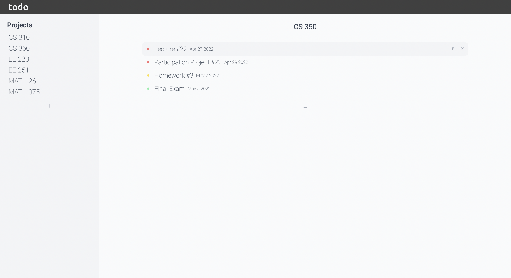

# Todo List

## Description

Simple todo list with support for different projects.

**Languages:** HTML, CSS JavaScript  
**Other tools/technologies:** Webpack, PubSubJS, date-fns

## Live Preview

Check it out [here](https://wzhengg.github.io/odin-todo-list/)  

## Motivation

The goal of this project was to practice organizing code by following 
object-oriented programming principles. Design patterns that were used include 
ES6 classes, ES6 modules, and the publish/subscribe pattern.

## Future tasks
* Fix modal issue in Safari
* Add modal for creating projects instead of using `prompt()`
* Improve form styling
* Use icons for add, delete, and edit buttons
* Add local storage
* Make it responsive